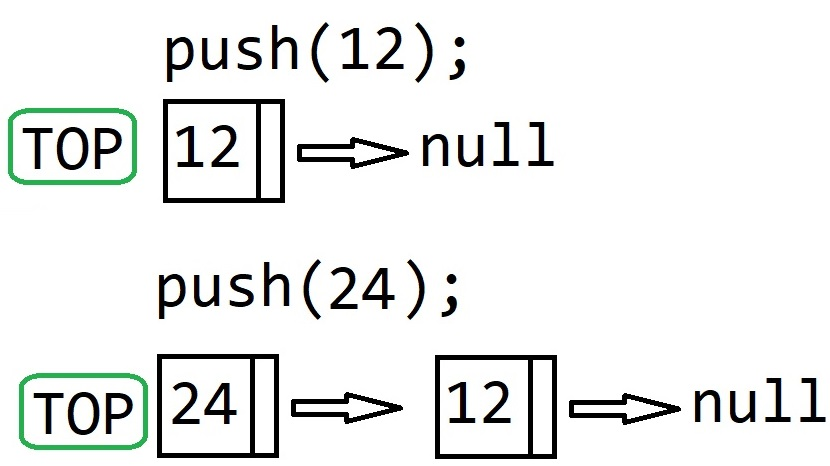
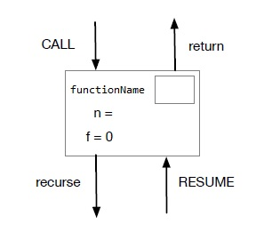
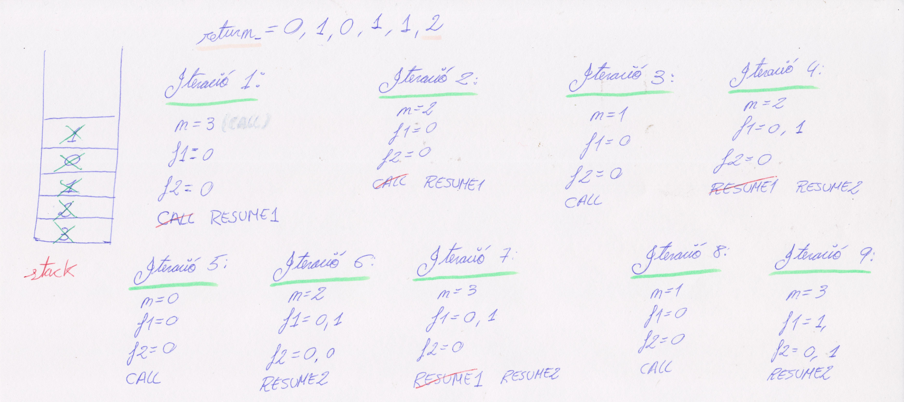

# Laboratori-3-EEDD

## Exercici 1: Definició i implementació de les piles:

En aquest primer apartat de la pràctica, és demana implementar l'interfície *Stack<E>*, la qual conté una totalitat de 4 mètodes diferents; un per afegir elements a la pila (push), un per treure l'element que està en el *top* de la pila (pop), un per comprovar si la pila està buida (isEmpty) i l'últim per retornar, sense esborrar, el *top* de la pila (top).
  
A continuació, s'ha implementat una classe anomenada *LinkedStack<E>*, la qual implementa la intefície anteriorment descrita. Abans de començar amb la implementació de cap dels mètodes, però, s'han definit un seguit de variables que s'inicialitzaràn en el constructor de la classe; la primera d'aquestes variables és la variable *first*, de tipus *Node* que marcarà el primer node. La segona és *stackSize* de tipus enter que marcarà la mida de la pila. La tercera s'anomena *modCount*, que marcarà el nombre de modificacions estructurals que pateixi la pila. La quarta i última, és la variable *message*, de tipus *String* que senzillament serà el missatge que es mostrarà per pantalla quan la pila estigui buida i sigui necessari llençar una excepció del tipus *NoSuchElementException*.
  
  A continuació, abans de inicialitzar les variables, s'ha implementat la classe *Node<E>* que serà la classe que crearà els nodes per poder fer realitat l'aspecte de una pila basada en *LinkedList*. Aquesta, és una classe interna, privada i estàtica, la qual, especifica que un node constarà d'un element *item* de tipus E i d'un element *next* de tipus *Node*.
  
  Un cop definida aquesta classe, ja es pot procedir amb el constructor de la classe *LinkedStack<E>*. Aquest constructor, inicialitza a null el primer node (*first*), inicialitza a 0 les dues variables enteres i assigna el missatge "*Empty stack*" a la variable de tipus *String*.
  
  Amb tot aquest treball previ realitzat, ja es pot començar la implementació dels mètodes de la interfície. Abans, però cal remarcar que el comportament de la pila a nivell gràfic es comporta tal i com s'observa en la següent imatge:
  
  

  
  Un cop vist com es comporta la pila, ja es pot començar amb la implementació de mètodes.
  
  El primer dels mètodes és el *push*, que rep un element del tipus E per paràmetre. Primerament, s'ha de salvar en un nou node l'actual first, per a que posteriorment es pugui establir que el node següent al firs és aquest *oldFirst*.
  
  Per crear el node *first*, s'usa la classe interna i s'estableix que l'*item* serà l'element de tipus E del paràmetre i que el següent serà el *oldFirst*.
  
  Finalment, s'incrementen en 1 tant el *stackSize* com el *modCount*.
  
  El següent dels mètodes, és el *top* que ha de retornar sense eliminar l'ultim element inserit en la pila. Solsament ha de retornar l'*item*, no el node sencer.
  
  Per fer-ho possible i considerant que la pila pot estar buida, es fa ús de l'estructura *try{} catch(){}* que, senzillament, retornarà (si pot) l'*item* del node *first* castejat a tipus E. En cas de no poder, és a dir, que la pila estigui buida, es llençarà una excepció del tipus *NoSuchElementException* amb el missatge "*Empty stack*".
  
  Seguidament, s'ha implementat el mètode *pop* que ha d'eliminar l'últim elemetn inserit en la pila. Atès el comportament de la pila (verure la imatge), per fer possible l'eliminació, senzillament, s'estableix que el node *first* passi a ser el següenti finalment es disminueix en 1 *stackSize* i s'augmenta en 1 el *modCount*. Val a dir que per aquesta funció també s'ha fet ús de l'estructura *try{} catch(){}* atès que la pila podría estar buida i no tindría cap mena de sentit esborrar un *top* que no existeix. En aquest cas es llençarà una excepció del tipus *NoSuchElementException* amb el missatge "*Empty stack*".
  
  L'últim mètode pertanyent a l'interfície, és el mètode *isEmpty* que retorna vertader si la pila està buida i fals en cas contrari. Senzillament, s'estableix que es retorni *true* si la variable que controla la mida de la pila (*stackSize*) es igual a 0 i el node *first* és null.
  
  Abans d'acabar amb la classe *LinkedStack*, cal comentar que s'han afegit els *getters* pertanyents a *stackSize*, *modCount* i *message*, els quals s'han utilitzat al llarg de la implementació de la classe.
  
  Per acabar aquest primer exercici, cal remarcar que totes les funcions, menys els *getters*, han estat sotmeses a una sèrie de jocs de proves per ratificar el seu correcte funcionament.

## Exercici 2: Fibonacci iteratiu:
  
  Després d'analitzar amb detall el codi proporcionat per el professorat, en aquest apartat es prodedirà a explicar el funcionament de l'algoritme que retorna el valor, corresponent a l'índex passat per paràmetre, de la seqüència de Fibonacci. Aquesta serà l'explicació del funcionament de l'algoritme iteratiu en el qual s'usen piles, tipus enumerats i una classe que definirà els contextos.
  
  En primer lloc, es defineixen la classe *Context* i el tipus enumerat;
  
  
  
  Un context serà cadascuna de les caixes creades durant l'execució i el tipus enumerat seràn les fletxes que entren i surten.
  
  En primer lloc es crea una variable entera que serà l'encarregada de emmagatzemar el resultat final.
  
  Seguidament, es crea una pila on es posaràn elements de tipus *Context* i s'hi introdueix, com a nou context, el paràmetre _n_.
  
  A continuació s'entrarà en bucle que s'executarà mentre quedin elements dintre de la susdita pila.
  
  A cada volta d'aquest bucle, la primera tasca serà crear un nou context amb el l'element suparior de la pila (el top de la pila).
  
  La segona de les tasques d'aquest bucle és comprovar en quin punt d'execució es troba aquell context (comprova el tipus enumerat). Aquesta comprovació es realitza mitjançant     un *switch*.
  
  En aquest switch hi ha 3 possibles casos a considerar;
  - Punt d'execució CALL.
  - Punt d'execució RESUME1.
  - Punt d'execució RESUME2.
  
  ### CALL:
  
  El comportament del primer dels casos, dependrà de si el valor de *n* es superior a 1 o no; en cas de ser-ho, es convertirà el context que s'està analitzant en un RESUME1 i es pujarà a la pila   un nou context però amb el valor *n - 1*.
  
  En cas que aquest valor *n* sigui inferior o igual a 1, s'establirà com a valor de la variable del resultat aquesta *n* i seguidament es treurà el valor de la pila mitjançant un *pop()*.
  
  ### RESUME1:
  
  El comportament del segin dels casos, serà sempre el mateix: s'establirà com a valor de la *f1* del context el valor de la variable de retorn. En segon lloc s'actualitzarà el context a RESUME2 i es pujarà a la pila un nou context amb el valor *n - 2*.
  
  ### RESUME2:
  
  El comportament de l'últim dels casos, també serà sempre igual: s'establirà com a valor de la *f2* del context el valor de la variable de retorn. Seguidament, s'actualitzarà el valor de la variable de retorn com la suma de les dues *f* (return_ = context.f1 + context.f2;) i finalment, s'esborrarà el context de la pila mitjançant un *pop()*.
  
  Un cop s'ha sortit del bucle solsament queda retornar la variable *return_* que es la qua conté el valor de la successió de Fibonacci corresponent a l'índex passat per paràmetre.
  
  
  ### Exemple d'execució:
  
Per entendre millor el funcionament de l'algoritme iteratiu, el seu comportament s'explicarà a través d'un exemple d'execució. En aquest cas l'exemple serà: _fibinacciIter(3)_.
  

  
Un cop inicialitzada la variable de retorn i la pila i s'ha pujat a la pila el paràmtre ja es pot entrar al bucle.
  
  La primera iteració te com a *n* un valor de 3 que és un *CALL*. El procediment a seguir, atès que la *n* és major a 1, és primerament actualitzar el context a *RESUME1* i en segon lloc, pujar a la pila un nou context de valor 2.
  
  La segona iteració, te com a valor *n* un 2 que també és un *CALL*. Per tant el procediment a seguir serà el mateix que en la primera iteració, és a dir, actualitzar el context a *RESUME1* i pujar a la pila un context de valor 1 (en aquest cas).
  
  La tercera iteració, te com a *n* un valor de 1 que és un *CALL*. En aquest cas, el procediment serà establir com a valor de la variable de retorn, el valor de *n* i seguidament, s'extreurà el context de la pila mitjançant una crida a la funció *pop()*.
  
  En la quarta iteració, el valor de *n* és 2 i és un *RESUME1*. Per tant, el procediment a seguir serà el següent: en primer lloc establir el valor de *f1* com el valor de la variable de retorn, en segon lloc actualitzar el context a *RESUME2* i finalment, pujar a la pila un valor de 0 (*n - 2*).
  
  En obtenir el top de la pila en la cinquena iteració, el valor de *n* és un 0 i és un *CALL*. Per tant, atès que el valor és menor a 1, s'haurà de establir com a valor de la variable de retorn aquest 0 i eliminar el contextr de la pila.
  
  En la iteració número 6, el valor de *n* és 2 i és un *RESUME2*. En aquest cas el procediment a seguir serà: en primer lloc, establir com a valor de la *f2* el valor que tingui en aquest moment la variable de retorn. Seguidament s'actualitzarà el valor de la variable de retorn com la suma de *f1* i *f2*. Per finalitzar, s'extreurà el context de la pila amb un *pop()*.
  
  En la setena iteració, el valor de *n* és 3 i és un *RESUME1*. Per tant, s'establirà el com a valor de *f1* el valor actual de la variable de retorn, s'actualitzarà el context a *RESUME2* i s'introduirà a la pila un valor de 1 (*n - 2*).
  
  La iteració vuit, té com a valor de *n* un 1 éssent aquest un *CALL*. Per tant, s'establirà com a valor de la variable de retorn aquest 1 i s'extreurà el context de la pila.
  
  En la novena i última iteració, solsament resta un valor de *n* igual 3 essent aquest un *RESUME2*. Per tant, el procediment, serà establir com a valor de la *f2* el valor de la variable de retorn, actualitzar el valor de la variable de retorn com la suma de *f1* i *f2* i per finalitzar, s'extreurà el context de la pila amb un *pop()*.
  
  Un cop s'ha sortit del bucle, resta retornar la variable que conté el valor de la successió de Fibonacci en l'índex que s'ha passat per paràmetre a la funció.
  
  La imatge anterior, mostra de manera gràfica com s'actualitzen tant els contextos com la pila.
